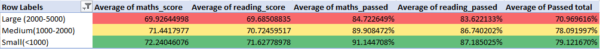
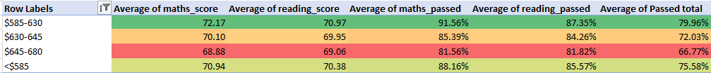
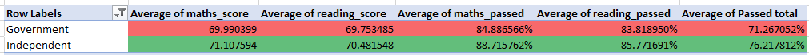
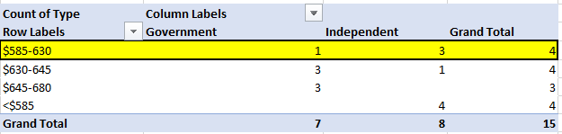
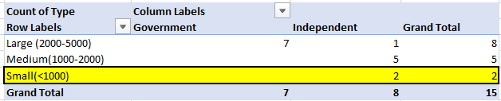
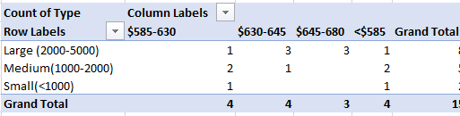

# Module 4 Challenge : pandas-challenge

## Written Report

The repository for this project is called pandas-challenge. Inside this repository, the folder PyCitySchools was created as requested.

Using Pandas and Jupyter Notebook, the report was created as required. Two observable trends are presented in the conclusions below.

## Local Government Area (LGA) Summary

Total number of unique schools

Total students

Total budget

Average maths score

Average reading score

% passing maths (the percentage of students who passed maths)

% passing reading (the percentage of students who passed reading)

% overall passing (the percentage of students who passed maths AND reading)

Note: A passing grade is 50 or higher.

The high-level snapshot of the local government area's key metrics is presented below:

## School Summary

School name

School type

Total students

Total school budget

Per student budget

Average maths score

Average reading score

% passing maths (the percentage of students who passed maths)

% passing reading (the percentage of students who passed reading)

% overall passing (the percentage of students who passed maths AND reading)

The School Summary key metrics are presented below:

## Top Performing Schools (By % Overall Passing)

## Bottom Performing Schools (By % Overall Passing)

## Maths Scores by Year

## Reading Scores by Year

## Scores by School Spending

## Scores by School Size

## Scores by School Type

## Conclusions -- Written Report

1.	Small schools have the highest Average Math and reading scores, with 72.24 % and 71.63 %, respectively. In contrast, the lowest average scores come from large schools, with 69.93% for Maths and 69.68 % for reading. Small schools also have the highest Overall number of students passing, with 79.12 % passing both Maths and Reading, as opposed to large schools, with the lowest overall passing scores of 70.97%.

2.	Overall, the highest grades for Math and Reading come from schools with a $585-630 budget per student, with 72.17 % average grade for math and 70.97 % for Reading. Conversely, the lowest overall grades come from schools with the highest budget per student ($645-680), with 6,8.88 % on average for Maths and 69.06% for reading. 

3.	Overall, the best-performing schools are Independent, with 71.11 % Average Math marks and 70.48 % Reading and 76.22 % of the students passing overall. On the other hand, in government schools, only 71.27% pass overall, with slightly lower marks of 69.99% for Maths and 69.75 % for reading, respectively. The top performing school, Griffin High School is an independent school with a $585-630 budget per student and the bottommost performing school, Hernandez High School, is a government school with the highest per Student budget of $645-680.

Tables matching the calculations above performed with Excel are presented below to corroborate the results

Other interesting tables below

## Submission

Submitted and available in GitHub under https://github.com/lcardsvr/pandas-challenge
Written report is included in the Readme.md file 

