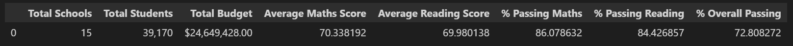
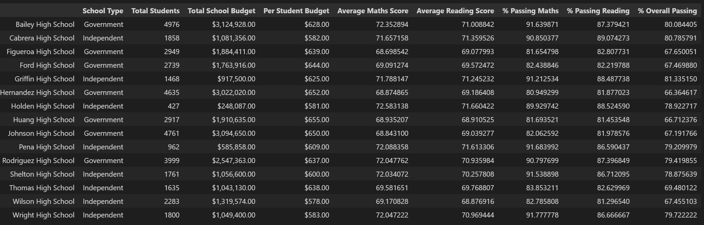
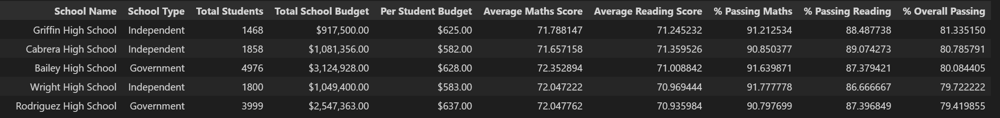
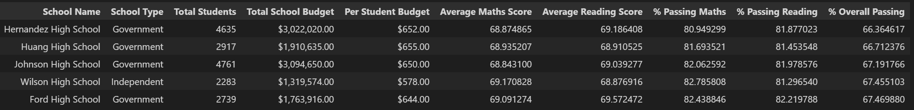
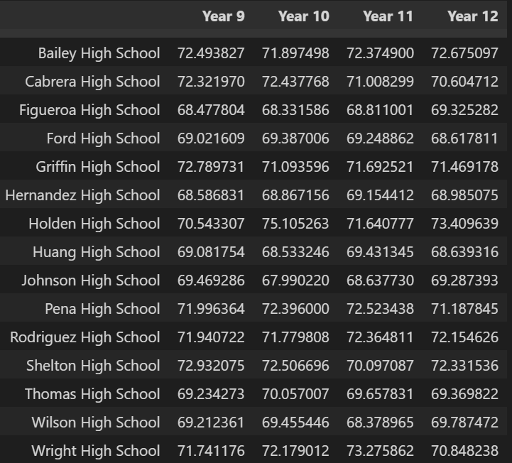
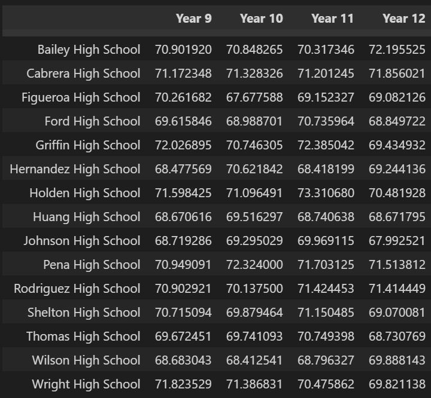
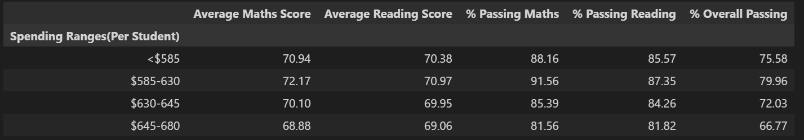
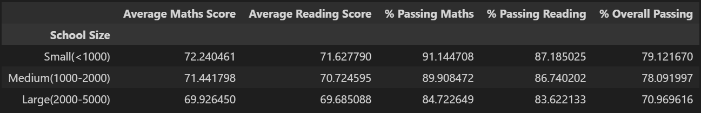
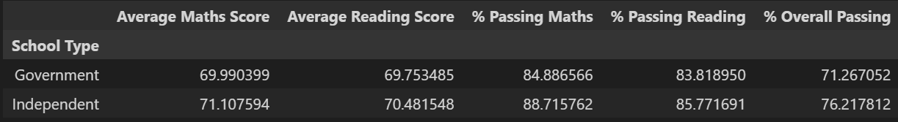

# Module 4 Challenge : pandas-challenge

## Written Report

The repository for this project is called pandas-challenge. Inside this repository, the folder PyCitySchools was created as requested.

Using Pandas and Jupyter Notebook, create a report that includes the following data. Your report must include a written description of at least two observable trends based on the data.

## Local Government Area (LGA) Summary

Total number of unique schools

Total students

Total budget

Average maths score

Average reading score

% passing maths (the percentage of students who passed maths)

% passing reading (the percentage of students who passed reading)

% overall passing (the percentage of students who passed maths AND reading)

Note: A passing grade is 50 or higher.

The high-level snapshot of the local government area's key metrics is presented below:

## School Summary

School name

School type

Total students

Total school budget

Per student budget

Average maths score

Average reading score

% passing maths (the percentage of students who passed maths)

% passing reading (the percentage of students who passed reading)

% overall passing (the percentage of students who passed maths AND reading)

The School Summary key metrics are presented below:

## Top Performing Schools (By % Overall Passing)

## Bottom Performing Schools (By % Overall Passing)

## Maths Scores by Year

## Reading Scores by Year

## Scores by School Spending

## Scores by School Size

## Scores by School Type

## Conclusions -- Written Report

1. A file called main.py with the main script to run for each analysis.

2. A Resources folder that contains the CSV files used. 

3. An analysis folder that contains the results text file from the analysis.

## Submission

Submitted and available in GitHub under https://github.com/lcardsvr/pandas-challenge
Written report is included in the Readme.md file 

